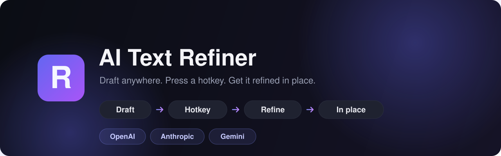
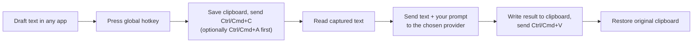

<p align="center">
  
</p>

<h1 align="center">AI Text Refiner</h1>

<p align="center">
  <b>Draft a message anywhere, press a hotkey, and your chosen LLM rewrites it in place.</b><br/>
  A lightweight, private, cross-platform menu-bar / tray app for polishing text in any application.
</p>

<p align="center">
  <a href="#-quick-start">Quick start</a> ·
  <a href="#-features">Features</a> ·
  <a href="#-how-it-works">How it works</a> ·
  <a href="#-configuration">Configuration</a> ·
  <a href="#-faq">FAQ</a> ·
  <a href="#-contributing">Contributing</a>
</p>

<p align="center">
  
  
  
  
  <a href="LICENSE"></a>
  <a href="https://github.com/flowdeskadmin/ai-text-refiner/stargazers"></a>
  <!--  -->
</p>

---

## ✨ Why?

Every app has a text box, but none of them have your favorite LLM and your favorite prompt one keystroke away. **AI Text Refiner** lives quietly in your tray and bridges that gap: select (or write) some text in Slack, Gmail, VS Code, a browser — anywhere — hit a global hotkey, and the refined version is pasted straight back, no copy-paste-juggling required.

- 🔒 **Private** — your API key is encrypted at rest with your OS keychain, and text goes **only** to the provider you choose. No middleman servers.
- ⚡ **Universal** — works in any app via clipboard + synthetic keystrokes; no per-app plugins.
- 🎛️ **Yours** — your provider, your model, your prompt, your hotkeys.

## 🚀 Quick start

```bash
# 1. Clone & install
git clone https://github.com/Flowdesktech/ai-text-refiner.git
cd ai-text-refiner
npm install

# 2. Launch the tray app + settings window
npm run dev
```

Then in the settings window:

1. Pick a **provider** (OpenAI / Anthropic / Gemini), paste your **API key**, choose a **model**.
2. Tweak the **refine prompt** — keep the `{{text}}` placeholder where the draft is inserted.
3. Record your **hotkeys** (defaults: `Ctrl/⌘ + Alt + R` for the selection, `Ctrl/⌘ + Alt + A` for the whole field).
4. Hit **Run test** to confirm your key works — no hotkey needed.

Now select a draft in any app and press your hotkey. ✨

## 🧩 Features

|                             |                                                                                         |
| --------------------------- | --------------------------------------------------------------------------------------- |
| 🌐 **Multi-provider**       | OpenAI, Anthropic (Claude), and Google Gemini — switch any time                         |
| 🤖 **Per-provider models**  | Curated model dropdowns (GPT-5.5, Claude Opus 4.8, Gemini 3.5 Pro, …) plus custom entry |
| ✍️ **Custom prompt**        | Editable instruction template with a `{{text}}` placeholder                             |
| ⌨️ **Two global hotkeys**   | One for the current **selection**, one to **select-all** the focused field              |
| 🎯 **In-place replacement** | Works in any app — editors, Slack, browsers, mail clients                               |
| 🌀 **Inline progress**      | An animated "Refining…" spinner right in the text field while you wait                  |
| 🔐 **Encrypted keys**       | API keys sealed with Electron `safeStorage` (OS keychain)                               |
| 📋 **Clipboard-safe**       | Saves and restores your original clipboard around each run                              |
| 🚀 **Launch on startup**    | Optional auto-start, runs hidden in the tray                                            |
| 🖥️ **Cross-platform**       | Windows, macOS, and Linux (X11)                                                         |

## 🔧 How it works

External apps don't expose their text fields to other programs, so AI Text Refiner uses a
clipboard + synthetic-keystroke bridge that works **everywhere** without per-app integration.



To avoid your still-held hotkey modifiers corrupting the synthetic copy/paste, the app waits a
beat and explicitly releases modifier keys before sending keystrokes.

## ⚙️ Configuration

All settings live in the in-app window and save automatically.

| Setting                    | Description                                                       |
| -------------------------- | ----------------------------------------------------------------- |
| Provider + API key + model | Key stored encrypted via OS keychain (`safeStorage`)              |
| Refine prompt              | Instruction template containing the `{{text}}` placeholder        |
| Refine-selection hotkey    | Copies the current selection, then refines it                     |
| Refine-entire-field hotkey | Sends `Ctrl/⌘+A` first to grab the whole field, then refines      |
| Inline progress            | Animated "Refining…" placeholder shown in the field while waiting |
| Restore clipboard          | Put your original clipboard contents back after pasting           |
| Launch on startup          | Start automatically when you log in (Windows/macOS)               |

### Provider request shapes

| Provider  | Endpoint                                                                               |
| --------- | -------------------------------------------------------------------------------------- |
| OpenAI    | `POST https://api.openai.com/v1/chat/completions`                                      |
| Anthropic | `POST https://api.anthropic.com/v1/messages` (`anthropic-version` header)              |
| Gemini    | `POST https://generativelanguage.googleapis.com/v1beta/models/{model}:generateContent` |

Each receives `prompt.replace("{{text}}", draft)` and returns the refined string.

## 🖥️ Platform notes

| OS                  | Status                  | Notes                                                                                                            |
| ------------------- | ----------------------- | ---------------------------------------------------------------------------------------------------------------- |
| **Windows**         | ✅ Works out of the box | —                                                                                                                |
| **macOS**           | ✅ Needs permission     | Grant **Accessibility** for synthetic keystrokes — the app detects this and links you to System Settings         |
| **Linux (X11)**     | ✅ Works                | —                                                                                                                |
| **Linux (Wayland)** | ⚠️ Limited              | Wayland blocks synthetic input; the app detects it and shows a clear warning (use the Test panel / manual paste) |

## 📦 Building installers

```bash
npm run pack:win     # NSIS installer (.exe)
npm run pack:mac     # dmg (configure signing/notarization for distribution)
npm run pack:linux   # AppImage
```

Built via [electron-builder](https://www.electron.build/); see `electron-builder.yml`.

### Automated releases

Pushing a version tag builds installers for **all three platforms** and publishes a GitHub
Release with the artifacts attached (see `.github/workflows/release.yml`):

```bash
npm version patch          # bumps package.json + creates a vX.Y.Z tag
git push --follow-tags     # triggers the Build & Release workflow
```

**Optional code signing** — set the repository variable `ENABLE_CODE_SIGNING=true` and provide
the relevant secrets to produce signed/notarized builds:

| Platform | Secrets                                                                                                       |
| -------- | ------------------------------------------------------------------------------------------------------------- |
| Windows  | `WINDOWS_CERTIFICATE`, `WINDOWS_CERTIFICATE_PASSWORD`                                                         |
| macOS    | `APPLE_CERTIFICATE`, `APPLE_CERTIFICATE_PASSWORD`, `APPLE_ID`, `APPLE_APP_SPECIFIC_PASSWORD`, `APPLE_TEAM_ID` |

## 🏗️ Project structure

```
src/
├─ main/            Electron main process
│  ├─ index.ts        app lifecycle, tray, global hotkeys, refine orchestration
│  ├─ automation.ts   clipboard save/restore + nut-js keystroke sequences
│  ├─ providers.ts    unified refine() → OpenAI / Anthropic / Gemini
│  └─ settings.ts     electron-store schema + safeStorage key encryption
├─ preload/         typed IPC bridge (window.refiner)
├─ renderer/        React settings UI + status overlay
└─ shared/          shared types & defaults
```

**Tech stack:** Electron · electron-vite · React · TypeScript · `@nut-tree-fork/nut-js`
(keystrokes) · `electron-store` (settings) · `safeStorage` (encryption) · electron-builder.

## ❓ FAQ

<details>
<summary><b>Is my text or API key sent anywhere besides the LLM provider?</b></summary>

No. Your text is sent **only** to the provider you configure, using your own API key. The key is
encrypted at rest with your OS keychain and never leaves your machine except in requests to that
provider.

</details>

<details>
<summary><b>Nothing gets pasted when I press the hotkey.</b></summary>

Make sure (1) the hotkey shows **"Active"** in settings (no conflict), (2) you've saved an API key,
and (3) on macOS you've granted Accessibility permission. For "Refine selected text" you must have
text selected; otherwise use the "Refine entire field" hotkey.

</details>

<details>
<summary><b>The inline spinner behaves oddly in my editor.</b></summary>

Some rich/code editors handle synthetic `Shift+Left` selection differently. Turn off
**"Show animated Refining… progress in the text field"** in settings to fall back to the corner overlay.

</details>

<details>
<summary><b>Which models are supported?</b></summary>

Any chat model from the three providers. The dropdowns list current flagships, and a **Custom…**
option lets you type any model id.

</details>

## 🗺️ Roadmap

- [ ] Multiple saved prompt presets (tone: formal / casual / concise)
- [ ] Streaming responses into the field
- [ ] Local model support (Ollama / LM Studio)
- [ ] Per-app prompt overrides
- [ ] Signed & notarized release binaries

Have an idea? [Open an issue](https://github.com/flowdeskadmin/ai-text-refiner/issues/new/choose). 💡

## 🤝 Contributing

Contributions are welcome! Please read [CONTRIBUTING.md](CONTRIBUTING.md) and our
[Code of Conduct](CODE_OF_CONDUCT.md). Found a security issue? See [SECURITY.md](SECURITY.md).

```bash
npm run dev          # run in development
npm run typecheck    # type-check main + renderer
npm run format       # format with Prettier
```

## ⭐ Support

If this saves you keystrokes, please **star the repo** — it genuinely helps others find it.

## 📄 License

[MIT](LICENSE) © Your Name
